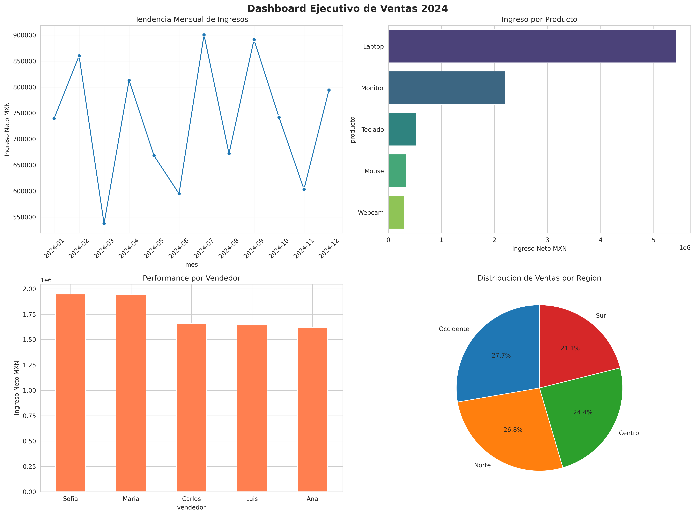

# Analisis de Ventas con Pandas

Pipeline ETL y analisis exploratorio de datos de ventas. Generacion de KPIs de negocio y dashboard ejecutivo.

## Objetivo
Demostrar dominio de Pandas para limpieza, transformacion y agregacion de datos transaccionales. Traducir datos crudos en insights accionables para toma de decisiones.

## Stack Tecnico
`Python` `Pandas` `NumPy` `Matplotlib` `Seaborn` `ETL` `Business Intelligence` `Data Analysis`

## Dataset
Simulacion de 1,000 transacciones de e-commerce 2024. Variables: fecha, producto, region, vendedor, precio, cantidad, descuento.

## Metodologia ETL
1. **Extract**: Simulacion de datos transaccionales
2. **Transform**: Feature engineering, calculo de ingresos, creacion de periodos
3. **Load**: Exportacion de agregados a CSV para herramientas BI
4. **Analysis**: GroupBy, Pivot, Metricas de negocio

## KPIs Calculados
- **Ingreso Total**: Suma de ingreso neto post-descuentos
- **Ticket Promedio**: Ingreso / Num transacciones
- **Top Productos**: Ranking por ingreso y volumen
- **Performance Vendedores**: Ranking por contribucion
- **Analisis Regional**: Distribucion geografica de ventas

## Resultados Clave
- Identificacion de Laptop como producto estrella por ingreso
- Estacionalidad detectada en Q4
- Region Centro lidera con 35% de ventas

## Dashboard Ejecutivo

El análisis genera un dashboard 2x2 con los principales KPIs de negocio:



**Insights del dashboard:**
1. **Tendencia Mensual**: Identifica estacionalidad y picos de venta
2. **Top Productos**: Ranking por contribución al ingreso total
3. **Performance Vendedores**: Compara productividad del equipo comercial  
4. **Distribución Regional**: Cuota de mercado por zona geográfica

*Este dashboard se exporta en alta resolución para presentaciones ejecutivas*

## Cómo ejecutarlo
```bash
pip install -r requirements.txt
python analisis_ventas.py
```
